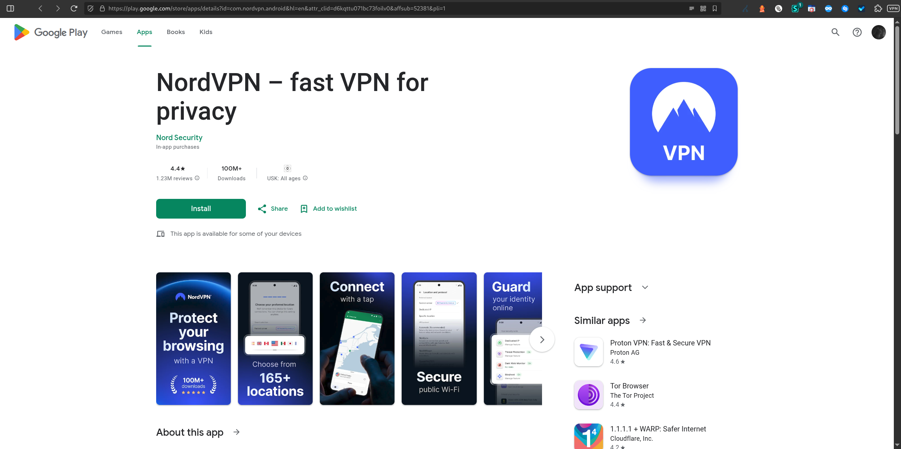

# Chain 10 – Mobile Simulated Domain Redirections for lagerfeuer.net

**Tracked:** Thursday, 05 March 2026 · 20:00–21:00 CET · Mobile simulated browser
**Threat category:** Affiliate abuse / VPN install

## Introduction

Chain 10 originates from press-to-see.com and lands at the NordVPN Android app listing on Google Play - a legitimate destination reached via an affiliate link (`affsub=52381`). The entry domain press-to-see.com shares server IP 168.119.149.123 with primechain-track.com from Chains 6 and 7, establishing operational linkage between the direct Play Store redirect and the fake video player infrastructure - consistent with a single actor operating both components. On mobile, the chain delivers the user directly to the Google Play Store install page, bypassing the fake video player used on desktop. Google Play's passive OAuth flow (accounts.google.com + OSID token exchange) is incidental - triggered by the Play Store itself rather than the redirect chain. The affiliate commission model provides financial incentive for the abuse of lagerfeuer.net's subscriber base.

## Redirect Flow

```
press-to-see.com (VPN affiliate entry point)
→ play.google.com (Google Play - NordVPN listing, login check)
→ accounts.google.com (Google Account passive login check)
→ play.google.com (OSID token exchange)
→ play.google.com (final destination - NordVPN on Google Play Store)
```

## Redirect Hops

| # | Status | IP | URL | Redirect Type | Notes |
|---|---|---|---|---|---|
| 1 | 307 | 168.119.149.123 | `https://press-to-see.com/index?lp=1` | temporary | VPN Affiliate Entry Point |
| 2 | 302 | 2a00:1450:4001:805::200e | `https://play.google.com/store/apps/details?id=c…` | temporary | Google Play – NordVPN Listing (Login Check) |
| 3 | 302 | 2a00:1450:4001:c21::54 | `https://accounts.google.com/ServiceLogin?passive=12…` | temporary | Google Account Passive Login Check |
| 4 | 302 | 2a00:1450:4001:805::200e | `https://play.google.com/accounts/SetOSID?authus…` | temporary | Google Play OSID Token Exchange |
| 5 | 200 | 2a00:1450:4001:805::200e | `https://play.google.com/store/apps/details?id=c…` | none | Final Destination – NordVPN on Google Play Store |

## Screenshots



## AI Security Analysis

*Automated threat assessment · claude-sonnet-4-6*

Chain 10 is the most legally ambiguous chain in the dataset. The final destination - NordVPN on the Google Play Store - is a legitimate, commercially available product from an established VPN provider. However, the delivery mechanism is entirely illegitimate: users are redirected to the Play Store via an unsolicited push notification using an undisclosed affiliate link, generating commission payments for the chain operators without user knowledge or consent.

The shared server IP 168.119.149.123 between press-to-see.com and primechain-track.com establishes operational linkage between the direct Play Store redirect (Chain 10) and the fake video player social engineering observed in Chains 6 and 7 - indicating NordVPN's affiliate programme may be benefiting financially from the same infrastructure responsible for those VPN promotion attacks.

Internet users who install NordVPN via this chain receive a functional product - but their installation financially rewards criminal infrastructure. This affiliate abuse should be formally reported to NordVPN's compliance and fraud team, as continued payouts to this affiliate ID constitute indirect funding of the broader malvertising operation documented in this report.

---
*Generated with Claude · lagerfeuer.net Domain Abuse Report · claude-sonnet-4-6*

## Raw Redirect Data

| Status Code | URL | IP | Page Type | Redirect Type | Redirect URL |
|---|---|---|---|---|---|
| 307 | `https://press-to-see.com/index?lp=1` | 168.119.149.123 | server_redirect | temporary | `https://play.google.com/store/apps/details?id=com.nordvpn.android&hl=en&attr_clid=d6kqttu071bc73foilv0&affsub=52381` |
| 302 | `https://play.google.com/store/apps/details?id=com.nordvpn.android&hl=en&attr_clid=d6kqttu071bc73foilv0&affsub=52381` | 2a00:1450:4001:805::200e | server_redirect | temporary | `https://accounts.google.com/ServiceLogin?passive=1209600&osid=1&continue=https://play.google.com/store/apps/details?id%3Dcom.nordvpn.android%26hl%3Den%26attr_clid%3Dd6kqttu071bc73foilv0%26affsub%3D52381&followup=https://play.google.com/store/apps/details?id%3Dcom.nordvpn.android%26hl%3Den%26attr_clid%3Dd6kqttu071bc73foilv0%26affsub%3D52381&hl=en&authuser=0` |
| 302 | `https://accounts.google.com/ServiceLogin?passive=1209600&osid=1&continue=https://play.google.com/store/apps/details?id%3Dcom.nordvpn.android…` | 2a00:1450:4001:c21::54 | server_redirect | temporary | `https://play.google.com/accounts/SetOSID?authuser=0&continue=https://play.google.com/store/apps/details?id%3Dcom.nordvpn.android%26hl%3Den%26attr_clid%3Dd6kqttu071bc73foilv0%26affsub%3D52381%26pli%3D1&osidt=ALWU2ctIkFbbX7xJrfaZCjszSqwGaEFG0NFi_PkzcDMvRmkE8BjBzhkMgT-LyCaCKdHUYINJcmBdSoxyQmybMn8qID8AGVb54QrhAq6VFCbPSm1zw31geQNhyU9Csxzop04w4_Xrxarsl2pujuU61zzt7G1SMsukxVhA3MkuT5sw1T9OVCL9h2WfoOjD1nwRoUenQ9h-uU-7CMihUl6yUwP5NxncvJc1QtYG8MWj6l6skeBJXUt71aMONZPPrb_ghics9UvXiZTYdWV11gN7TfKMbMzahyA443BUb5cGJEZeIOU0a4CKoNS9L4YnzwexeiW7PmXRGSWK7tQgA_Oaf6XYSmHiuH4FkzRhDLCrjM4Wddimh9oxD8vGPPfAjQsJcXSbrcAN9oIGGfPSHu5Ygo9Kker9hYbW17tnt30tCS9nh5ducGirqvPvP4TTMLJ0_EGznAWaqVtyj71XilQQlhLUmOEEwegjYImyJd3bgN93KyceYhcBd1Y&ifkv=ASfE1-ovudNTVdSPo-CeelOl4Wt807pLN_8xNlEyi391AkQaeNtIE-Cf-Q5K_j85FTGKzI25wl9tWA` |
| 302 | `https://play.google.com/accounts/SetOSID?authuser=0&continue=…&osidt=ALWU2ctIkFbbX7xJrfaZCjszSqwGaEFG0NFi_PkzcDMvRmkE8BjBzhkMgT-LyCaCKdHUYINJcmBdSoxyQmybMn8qID8AGVb54QrhAq6VFCbPSm1zw31geQNhyU9Csxzop04w4_Xrxarsl2pujuU61zzt7G1SMsukxVhA3MkuT5sw1T9OVCL9h2WfoOjD1nwRoUenQ9h-uU-7CMihUl6yUwP5NxncvJc1QtYG8MWj6l6skeBJXUt71aMONZPPrb_ghics9UvXiZTYdWV11gN7TfKMbMzahyA443BUb5cGJEZeIOU0a4CKoNS9L4YnzwexeiW7PmXRGSWK7tQgA_Oaf6XYSmHiuH4FkzRhDLCrjM4Wddimh9oxD8vGPPfAjQsJcXSbrcAN9oIGGfPSHu5Ygo9Kker9hYbW17tnt30tCS9nh5ducGirqvPvP4TTMLJ0_EGznAWaqVtyj71XilQQlhLUmOEEwegjYImyJd3bgN93KyceYhcBd1Y` | 2a00:1450:4001:805::200e | server_redirect | temporary | `https://play.google.com/store/apps/details?id=com.nordvpn.android&hl=en&attr_clid=d6kqttu071bc73foilv0&affsub=52381&pli=1` |
| 200 | `https://play.google.com/store/apps/details?id=com.nordvpn.android&hl=en&attr_clid=d6kqttu071bc73foilv0&affsub=52381&pli=1` | 2a00:1450:4001:805::200e | normal | none | none |
