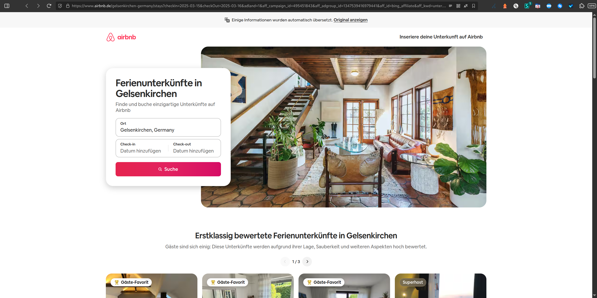

# Chain 11 – Mobile Simulated Domain Redirections for lagerfeuer.net

**Tracked:** Thursday, 05 March 2026 · 20:00–21:00 CET · Mobile simulated browser
**Threat category:** Legitimate advertising (Bing/Yahoo)

## Introduction

Chain 11 is the most legitimately-sourced chain in the dataset. It originates from travellookups.shopperbasics.com, an ad network rotator within the shopperbasics.com travel affiliate network, and terminates at a specific Airbnb Gelsenkirchen accommodations search - a fully legitimate booking platform. The routing passes through Yahoo Search referral tracking and a Microsoft Advertising (Bing) click tracker before reaching airbnb.com, which then performs a standard locale redirect to airbnb.de. Like Chain 8, this chain represents a legitimate paid advertising placement. Its co-existence with malvertising chains in the same push notification rotation is analytically significant: the presence of legitimate placements generates real revenue and provides plausible cover against enforcement by demonstrating good-faith advertising activity alongside the harmful content documented in this report.

## Redirect Flow

```
travellookups.shopperbasics.com (ad network entry point)
→ r.search.yahoo.com (Yahoo Search ad tracker)
→ www.bing.com (Bing ad click tracker)
→ www.airbnb.com (locale redirect to airbnb.de)
→ www.airbnb.de (final destination - Airbnb Gelsenkirchen Stays)
```

## Redirect Hops

| # | Status | IP | URL | Redirect Type | Notes |
|---|---|---|---|---|---|
| 1 | 302 | 54.189.45.13 | `https://travellookups.shopperbasics.com/search?q=unterkunft+gel…` | temporary | Ad Network Entry Point |
| 2 | 302 | 2a00:1288:110:c104::2000 | `https://r.search.yahoo.com/_ylt=AwrNmRaLjsFn5acAN7…` | temporary | Yahoo Search Ad Tracker |
| 3 | 302 | 2a02:26f0:3380:1c::17c8:1895 | `https://www.bing.com/aclick?ld=e8mWKrN3-lKi-…` | temporary | Bing Ad Click Tracker |
| 4 | 307 | 23.200.24.97 | `https://www.airbnb.com/gelsenkirchen-germany/s…` | temporary | Locale Redirect – airbnb.com to airbnb.de |
| 5 | 200 | 23.200.24.91 | `https://www.airbnb.de/gelsenkirchen-germany/s…` | none | Final Destination – Airbnb Gelsenkirchen Stays |

## Screenshots



## AI Security Analysis

*Automated threat assessment · claude-sonnet-4-6*

Chain 11, like Chain 8, is a legitimately-sourced advertising chain - this time from the shopperbasics.com travel affiliate network, landing on an Airbnb Gelsenkirchen search page via standard Yahoo and Bing tracking infrastructure. No direct security risk to the individual user is present in this specific chain.

The analytical significance of Chain 11 lies in the pattern it completes: lagerfeuer.net's push notification rotation systematically mixes genuinely legitimate advertising placements (Chains 8 and 11) with political disinformation (Chains 2 and 4), financial fraud (Chain 5), VPN social engineering (Chains 6, 7 and 10), and predatory gambling (Chain 9). This deliberate mixing serves dual purposes: legitimate revenue subsidises the infrastructure, and the good-faith traffic provides cover against enforcement - the domain operator can point to Airbnb and health supplement advertising as evidence of a functioning, compliant ad network.

This pattern is well-documented in academic literature on malvertising ecosystems and has been used successfully as a defence in domain abuse cases. Regulatory action against lagerfeuer.net must account for this mixed-use model to prevent the legitimate traffic from undermining enforcement proceedings.

---
*Generated with Claude · lagerfeuer.net Domain Abuse Report · claude-sonnet-4-6*

## Raw Redirect Data

| Status Code | URL | IP | Page Type | Redirect Type | Redirect URL |
|---|---|---|---|---|---|
| 302 | `https://travellookups.shopperbasics.com/search?q=unterkunft+gelsenkirchen&domcmp=D16-S33-B0&dompub=D16&domsrc=S33&adid=668282097613&kw=unterkunft+gelsenkirchen&mt=p&net=o&device=m&adpos=&loc=9041581&locphy=9042233&locint=&adgrp=1347539416979441&campaign=495451843&targid=kwd-79437804903011:loc-72&uid=668282097613&target=kwd-79437804903011:loc-72&ver=v1` | 54.189.45.13 | server_redirect | temporary | `https://r.search.yahoo.com/_ylt=AwrNmRaLjsFn5acAN7tXNyoA;_ylu=Y29sbwNiZjEEcG9zAzEEdnRpZAMEc2VjA3Ny/RV=2/RE=1741991070/RO=10/RU=https%3a%2f%2fwww.bing.com%2faclick%3fld%3de8mWKrN3-lKi-9LM7yx8UqGzVUCUy9dYj8TUmIj4bWJv0grSaRVNTdLVjx2GYlfYvIKvZx_7aJdNLRdkEi5zZolW_rHzTNcBpAMU_9EuJFvO1P4KF4IfvkR_d5IcuWbSnEP1BmPHG11h6Ke9vBP6pWZQ-pRTSEHnDlQs1-WTL6a6bVb%26u%3daHR0cHM6Ly93d3cuYWlyYm5iLmNvbS9nZWxzZW5raXJjaGVuLWdlcm1hbnkvc3RheXM_…%26rlid%3d0748fe96fd7040f0b3a14f5bd4bf2eb4/RK=2/RS=VUNwVFMR7Gh0QaTJsK_i5Ul28Js-` |
| 302 | `https://r.search.yahoo.com/_ylt=AwrNmRaLjsFn5acAN7tXNyoA;…` | 2a00:1288:110:c104::2000 | server_redirect | temporary | `https://www.bing.com/aclick?ld=e8mWKrN3-lKi-9LM7yx8UqGzVUCUy9dYj8TUmIj4bWJv0grSaRVNTdLVjx2GYlfYvIKvZx_7aJdNLRdkEi5zZolW_rHzTNcBpAMU_9EuJFvO1P4KF4IfvkR_d5IcuWbSnEP1BmPHG11h6Ke9vBP6pWZQ-pRTSEHnDlQs1-WTL6a6bVb&u=aHR0cHM6Ly93d3cuYWlyYm5iLmNvbS9nZWxzZW5raXJjaGVuLWdlcm1hbnkvc3RheXM_Y2hlY2tJbj0yMDI1LTAzLTE1JmNoZWNrT3V0PTIwMjUtMDMtMTYmYWRsYW5kPTEmYWZmX2NhbXBhaWduX2lkPTQ5NTQ1MTg0MyZhZmZfYWRncm91cF9pZD0xMzQ3NTM5NDE2OTc5NDQxJmFmZl9pZD1iaW5nX2FmZmlsaWF0ZSZhZmZfa3dkPXVudGVya3VuZnQrZ2Vsc2Vua2lyY2hlbiZhZmZfZGV2aWNlPW0mYWZmX21hdGNodHlwZT1wJmFmZl9hZGlkPTY2ODI4MjA5NzYxMyZhZmZfbmV0d29yaz1taWNyb3NvZnRfYWZmaWxpYXRlJmFmZl90YXJnZXRfaWQ9a3dkLTc5NDM3ODA0OTAzMDExOmxvYy03MiZhZmZfbG9jYXRpb25faW50ZXJlc3Q9JmFmZl9sb2NhdGlvbl9waHlzaWNhbD05MDQyMjMz&rlid=0748fe96fd7040f0b3a14f5bd4bf2eb4` |
| 302 | `https://www.bing.com/aclick?ld=e8mWKrN3-lKi-9LM7yx8UqGzVUCUy9dYj8TUmIj4bWJv0grSaRVNTdLVjx2GYlfYvIKvZx_7aJdNLRdkEi5zZolW_rHzTNcBpAMU_9EuJFvO1P4KF4IfvkR_d5IcuWbSnEP1BmPHG11h6Ke9vBP6pWZQ-pRTSEHnDlQs1-WTL6a6bVb&u=aHR0cHM6Ly93d3cuYWlyYm5iLmNvbS9nZWxzZW5raXJjaGVuLWdlcm1hbnkvc3RheXM_…&rlid=0748fe96fd7040f0b3a14f5bd4bf2eb4` | 2a02:26f0:3380:1c::17c8:1895 | server_redirect | temporary | `https://www.airbnb.com/gelsenkirchen-germany/stays?checkIn=2025-03-15&checkOut=2025-03-16&adland=1&aff_campaign_id=495451843&aff_adgroup_id=1347539416979441&aff_id=bing_affiliate&aff_kwd=unterkunft+gelsenkirchen&aff_device=m&aff_matchtype=p&aff_adid=668282097613&aff_network=microsoft_affiliate&aff_target_id=kwd-79437804903011:loc-72&aff_location_interest=&aff_location_physical=9042233` |
| 307 | `https://www.airbnb.com/gelsenkirchen-germany/stays?checkIn=2025-03-15&checkOut=2025-03-16&adland=1&aff_campaign_id=495451843…` | 23.200.24.97 | server_redirect | temporary | `https://www.airbnb.de/gelsenkirchen-germany/stays?checkIn=2025-03-15&checkOut=2025-03-16&adland=1&aff_campaign_id=495451843&aff_adgroup_id=1347539416979441&aff_id=bing_affiliate&aff_kwd=unterkunft+gelsenkirchen&aff_device=m&aff_matchtype=p&aff_adid=668282097613&aff_network=microsoft_affiliate&aff_target_id=kwd-79437804903011:loc-72&aff_location_interest=&aff_location_physical=9042233` |
| 200 | `https://www.airbnb.de/gelsenkirchen-germany/stays?checkIn=2025-03-15&checkOut=2025-03-16&adland=1&aff_campaign_id=495451843…` | 23.200.24.91 | normal | none | none |
