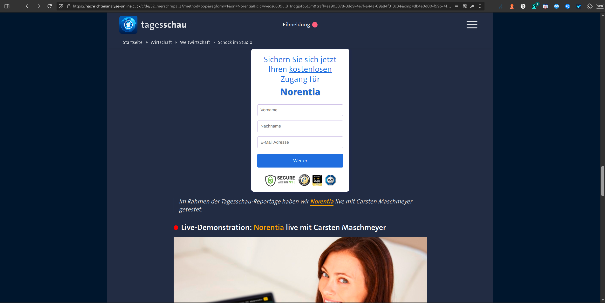

# Chain 4 – Desktop Domain Redirection for lagerfeuer.net

**Tracked:** Thursday, 05 March 2026 · 20:00–21:00 CET · Desktop browser simulation
**Threat category:** Political disinformation (Merz/Chrupalla) - second auction slot

## Introduction

Chain 4 is structurally identical to Chain 2 - it enters via xml-v4.pushub.net and terminates at nachrichtenanalyse-online.click via beedirect.vip. The key difference lies in the Pushub click parameters: the `i` click identifier and `ci` campaign integer differ from Chain 2, indicating this represents a separate auction or rotation slot served to the same browser session within the same hour. The repeated appearance of the Merz/Chrupalla disinformation page across multiple independent chains confirms that this campaign is actively being bought through the push notification ad exchange at scale.

## Redirect Flow

```
xml-v4.pushub.net (Pushub push notification click endpoint)
→ beedirect.vip (offer bidding & distribution hub)
→ nachrichtenanalyse-online.click (disinformation landing page)
```

## Redirect Hops

| # | Status | IP | URL | Redirect Type | Notes |
|---|---|---|---|---|---|
| 1 | 302 | 173.239.53.32 | `https://xml-v4.pushub.net/click2?i=MvMGe2GOHlI_0&…` | temporary | - |
| 2 | 302 | 2600:9000:2644:b400:15:545f:c980:93a1 | `https://beedirect.vip/472bd99f-65d0-4b90-9181…` | temporary | - |
| 3 | 200 | 2606:4700:3032::6815:1016 | `https://nachrichtenanalyse-online.click/c/de/52_merzchrupalla/?…` | none | - |

## Screenshots




## AI Security Analysis

*Automated threat assessment · claude-sonnet-4-6*

Chain 4 is functionally identical to Chain 2 in its disinformation payload, but its significance lies in what it reveals about the scale of the operation. The different Pushub click identifiers (`i=MvMGe2GOHlI_0`, `ci=3021703733061040757`) confirm this was served as a separate auction slot within the same monitoring session - meaning multiple simultaneous bidders are purchasing push notification inventory through the Pushub/pornamigo network for disinformation campaigns at the same time.

For internet users, the repetition of the same Merz/Chrupalla campaign across multiple independent chains within a single hour (20:00–21:00 CET) indicates an aggressive, high-volume operation actively targeting German push notification audiences. The substantial advertising budget required to maintain multiple parallel auction slots is consistent with a coordinated influence operation rather than opportunistic spam.

The repeated delivery of the same disinformation content to the same audience across multiple impressions within a short timeframe is a recognised technique for increasing belief adoption - a phenomenon documented in media manipulation research as the "illusory truth effect."

---
*Generated with Claude · lagerfeuer.net Domain Abuse Report · claude-sonnet-4-6*

## Raw Redirect Data

| Status Code | URL | IP | Page Type | Redirect Type | Redirect URL |
|---|---|---|---|---|---|
| 302 | `https://xml-v4.pushub.net/click2?i=MvMGe2GOHlI_0&ci=3021703733061040757&j=rv%3Db%26ss%3D2048x1152…` | 173.239.53.32 | server_redirect | temporary | `https://beedirect.vip/472bd99f-65d0-4b90-9181-567124d140cb?pubfeed_subid=1016057_236836&offer=3459802&banner=7342011&campaign=1903873&pubfeed=1016057&subid=236836&bid=0.0036&clickid=Ke8-iRmTOnU` |
| 302 | `https://beedirect.vip/472bd99f-65d0-4b90-9181-567124d140cb?pubfeed_subid=1016057_236836&offer=3459802&banner=7342011&campaign=1903873&pubfeed=1016057&subid=236836&bid=0.0036&clickid=Ke8-iRmTOnU` | 2600:9000:2644:b400:15:545f:c980:93a1 | server_redirect | temporary | `https://nachrichtenanalyse-online.click/c/de/52_merzchrupalla/?method=pop&regform=1&on=Norentia&icid=wdcu8lfic943fnog378228cg&traff=ee903878-3dd9-4e7f-a44a-09a84f313c34&cmp=472bd99f-65d0-4b90-9181-567124d140cb` |
| 200 | `https://nachrichtenanalyse-online.click/c/de/52_merzchrupalla/?method=pop&regform=1&on=Norentia&icid=wdcu8lfic943fnog378228cg&traff=ee903878-3dd9-4e7f-a44a-09a84f313c34&cmp=472bd99f-65d0-4b90-9181-567124d140cb` | 2606:4700:3032::6815:1016 | normal | none | none |
