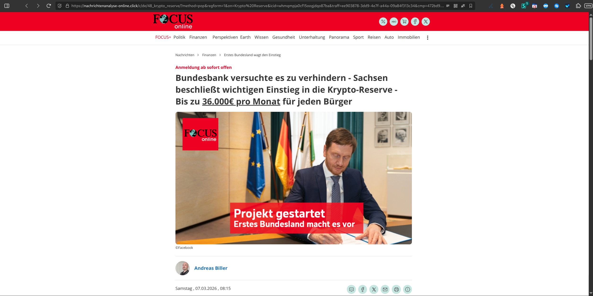
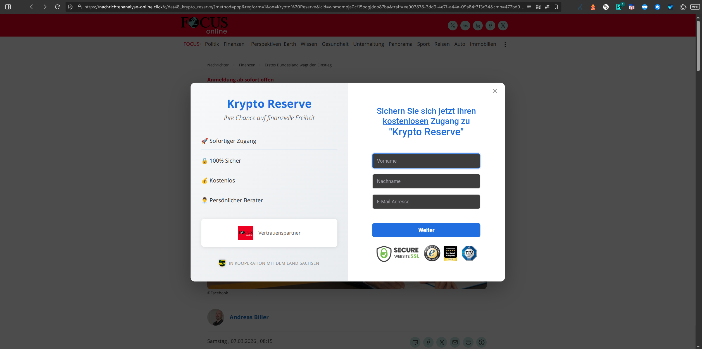

# Chain 5 – Desktop Domain Redirection for lagerfeuer.net

**Tracked:** Thursday, 05 March 2026 · 20:00–21:00 CET · Desktop browser simulation
**Threat category:** Financial fraud (Krypto Reserve scam)

## Introduction

Chain 5 uses the same pushub.net → beedirect.vip pipeline as Chains 2 and 4, but the beedirect.vip offer parameters resolve to a different campaign: the "Krypto Reserve" landing page on nachrichtenanalyse-online.click rather than the Merz/Chrupalla political content. This demonstrates that beedirect.vip operates a dynamic offer rotation - the same distribution hub selects different disinformation campaigns based on real-time bidding parameters. The domain nachrichtenanalyse-online.click is thus a multi-campaign disinformation platform, serving both political and financial fraud content from the same infrastructure.

## Redirect Flow

```
xml-v4.pushub.net (Pushub push notification click endpoint)
→ beedirect.vip (offer bidding & distribution hub)
→ nachrichtenanalyse-online.click (Krypto Reserve campaign)
```

## Redirect Hops

| # | Status | IP | URL | Redirect Type | Notes |
|---|---|---|---|---|---|
| 1 | 302 | 173.239.53.32 | `https://xml-v4.pushub.net/click2?i=KcCDL4uOgLE_0&…` | temporary | - |
| 2 | 302 | 2600:9000:2017:c000:15:545f:c980:93a1 | `https://beedirect.vip/472bd99f-65d0-4b90-9181…` | temporary | - |
| 3 | 200 | 2606:4700:3032::6815:1016 | `https://nachrichtenanalyse-online.click/c/de/48_krypto_reserve/…` | none | Final Destination – Krypto Reserve campaign |

## Screenshots





## AI Security Analysis

*Automated threat assessment · claude-sonnet-4-6*

Chain 5 reveals that nachrichtenanalyse-online.click is not a single-campaign disinformation page but a multi-campaign fraud platform. The same domain that serves the Merz/Chrupalla political disinformation in Chains 2 and 4 now delivers a "Krypto Reserve" financial fraud landing page - a fake cryptocurrency investment scheme.

Financial fraud of this nature poses the most direct and quantifiable risk to internet users in this dataset. Cryptocurrency scam pages typically use fake celebrity endorsements, artificial urgency, and fabricated investment returns to extract initial deposits, after which victims are pressured for additional funds and ultimately unable to withdraw. Average reported losses in such schemes in Germany run to several thousand euros per victim.

The reuse of the same domain for both political disinformation and financial fraud strongly suggests a single criminal actor operating across multiple fraud verticals simultaneously. This convergence - using the same infrastructure for influence operations and direct financial crime - is a significant escalation pattern that warrants law enforcement attention beyond standard advertising abuse reporting.

---
*Generated with Claude · lagerfeuer.net Domain Abuse Report · claude-sonnet-4-6*

## Raw Redirect Data

| Status Code | URL | IP | Page Type | Redirect Type | Redirect URL |
|---|---|---|---|---|---|
| 302 | `https://xml-v4.pushub.net/click2?i=KcCDL4uOgLE_0&ci=4452604377032219557&j=rv%3Db%26ss%3D2048x1152…` | 173.239.53.32 | server_redirect | temporary | `https://beedirect.vip/472bd99f-65d0-4b90-9181-567124d140cb?pubfeed_subid=1016057_236836&offer=3459802&banner=7342011&campaign=1903873&pubfeed=1016057&subid=236836&bid=0.0036&clickid=PcrUFwpa26U` |
| 302 | `https://beedirect.vip/472bd99f-65d0-4b90-9181-567124d140cb?pubfeed_subid=1016057_236836&offer=3459802&banner=7342011&campaign=1903873&pubfeed=1016057&subid=236836&bid=0.0036&clickid=PcrUFwpa26U` | 2600:9000:2017:c000:15:545f:c980:93a1 | server_redirect | temporary | `https://nachrichtenanalyse-online.click/c/de/48_krypto_reserve/?method=pop&regform=1&on=Krypto%20Reserve&icid=whmqmpja0cf15oogjdqo87ba&traff=ee903878-3dd9-4e7f-a44a-09a84f313c34&cmp=472bd99f-65d0-4b90-9181-567124d140cb&state` |
| 200 | `https://nachrichtenanalyse-online.click/c/de/48_krypto_reserve/?method=pop&regform=1&on=Krypto%20Reserve&icid=whmqmpja0cf15oogjdqo87ba&traff=ee903878-3dd9-4e7f-a44a-09a84f313c34&cmp=472bd99f-65d0-4b90-9181-567124d140cb&state` | 2606:4700:3032::6815:1016 | normal | none | none |
