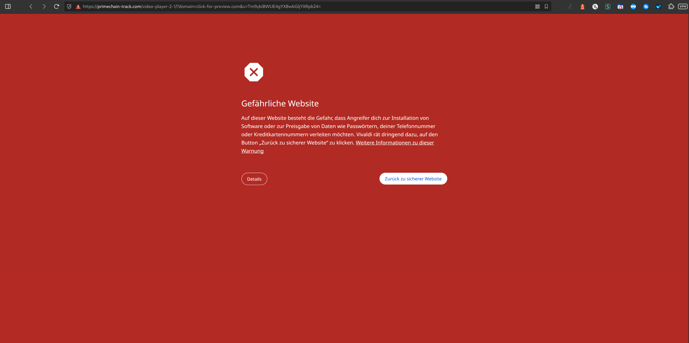
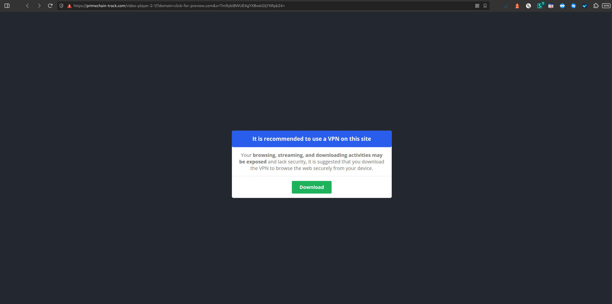

# Chain 6 – Mobile Simulated Domain Redirections for lagerfeuer.net

**Tracked:** Thursday, 05 March 2026 · 20:00–21:00 CET · Mobile simulated browser
**Threat category:** Social engineering / VPN install prompt

## Introduction

This is the first mobile-simulated chain in the dataset, and represents a distinct campaign network from the Pushub/beedirect chains. The entry point sumat-uah.com - also observed as the visitor-registration layer in Chain 7 - here acts as the first hop rather than an intermediate layer, suggesting a different upstream trigger. From sumat-uah.com traffic flows through click-for-preview.com, the same distribution hub used in Chain 1, and terminates at primechain-track.com - a fake video player page designed to prompt VPN installation. The mobile user-agent likely triggered a different offer from click-for-preview.com's rotation compared to the desktop chains.

## Redirect Flow

```
sumat-uah.com (traffic entry point / click redirector)
→ click-for-preview.com (tracking & distribution hub)
→ primechain-track.com (fake video player / VPN promotion)
```

## Redirect Hops

| # | Status | IP | URL | Redirect Type | Notes |
|---|---|---|---|---|---|
| 1 | 302 | 34.192.204.134 | `http://sumat-uah.com/zclkredirect?visitid=1c…` | temporary | Traffic Entry Point / Click Redirector |
| 2 | 307 | 168.119.149.123 | `https://click-for-preview.com/index?cid=0c2805273d7d4…` | temporary | Tracking & Distribution Hub |
| 3 | 200 | 2a06:98c1:3120::3 | `https://primechain-track.com/video-player-2-1/?domai…` | none | Final Destination – Fake Video Player / VPN Promotion |

## Screenshots





## AI Security Analysis

*Automated threat assessment · claude-sonnet-4-6*

Chain 6 targets mobile users with a social engineering attack designed to prompt VPN application installation. The landing page at primechain-track.com presents a fake video player - a well-documented social engineering pattern - that simulates a "buffering" or "connection error" and recommends installing a VPN to resolve it.

In practice, the promoted application may be a legitimate VPN generating affiliate revenue for the fraudsters (as seen in Chain 10), a data-harvesting application masquerading as a privacy tool, or in a worst-case scenario, malware disguised as a security product. The irony should not be overlooked: users seeking to protect their privacy are manipulated into installing the very tool that may enable further surveillance of their device.

Mobile users are particularly vulnerable because application install prompts on Android devices are visually similar to system dialogs, reducing the psychological friction that might otherwise prevent installation. This chain should be treated as a high-risk social engineering attempt.

---
*Generated with Claude · lagerfeuer.net Domain Abuse Report · claude-sonnet-4-6*

## Raw Redirect Data

| Status Code | URL | IP | Page Type | Redirect Type | Redirect URL |
|---|---|---|---|---|---|
| 302 | `http://sumat-uah.com/zclkredirect?visitid=1cefb151-18af-11f1-8d8f-12478f4a88df&type=js&browserWidth=980&browserHeight=2243&iframeDetected=false&webdriverDetected=false&gpu=Google%20Inc.%20(AMD)…&timezone=UTC%2B01%3A00&timezoneName=Europe%2FBerlin` | 34.192.204.134 | server_redirect | temporary | `https://click-for-preview.com/index?cid=0c2805273d7d46b084f137290a75941e&extclickid=zr1cefb15118af11f18d8f12478f4a88df968a3d55f5f443ea8c5f7a183c1e0793097960350bc6865e08&cost=0.015000&t1=uniform-kue-v244q2o9d9&t2=0&type=default&keyword=lagerfeuer%2Clagerfeuer.net&source=badious-buzzard&campaign_id=2715915&keyword_match=broad&match=` |
| 307 | `https://click-for-preview.com/index?cid=0c2805273d7d46b084f137290a75941e&extclickid=zr1cefb15118af11f18d8f12478f4a88df968a3d55f5f443ea8c5f7a183c1e0793097960350bc6865e08&cost=0.015000…` | 168.119.149.123 | server_redirect | temporary | `https://primechain-track.com/video-player-2-1/?domain=click-for-preview.com&x=Tm9ybiBWUE4gYXBwbGljYXRpb24=` |
| 200 | `https://primechain-track.com/video-player-2-1/?domain=click-for-preview.com&x=Tm9ybiBWUE4gYXBwbGljYXRpb24=` | 2a06:98c1:3120::3 | normal | none | none |
