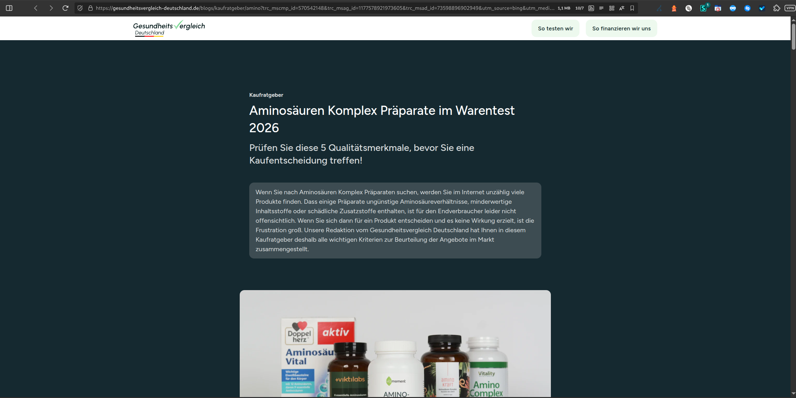

# Chain 8 – Mobile Simulated Domain Redirections for lagerfeuer.net

**Tracked:** Thursday, 05 March 2026 · 20:00–21:00 CET · Mobile simulated browser
**Threat category:** Legitimate advertising (Bing/Yahoo)

## Introduction

Chain 8 stands apart from the preceding chains: it originates from health-browsers.theconsumersearch.com, a domain within the theconsumersearch.com ad network, and terminates at gesundheitsvergleich-deutschland.de - a legitimate German health product comparison site promoting Viktilabs Amino 8. The routing passes through Yahoo Search referral tracking and a Microsoft Advertising (Bing) click tracker, suggesting this represents a paid search or display advertising placement rather than malvertising. Its presence in this dataset alongside the malvertising chains confirms that the push notification ad rotation observed during this monitoring session includes both legitimate advertising placements and harmful content - a pattern that provides plausible cover against enforcement actions targeting the malicious chains.

## Redirect Flow

```
health-browsers.theconsumersearch.com (ad network entry point)
→ r.search.yahoo.com (Yahoo Search ad tracker)
→ www.bing.com (Bing ad click tracker)
→ gesundheitsvergleich-deutschland.de (final destination - amino supplement product page)
```

## Redirect Hops

| # | Status | IP | URL | Redirect Type | Notes |
|---|---|---|---|---|---|
| 1 | 302 | 52.12.55.19 | `https://health-browsers.theconsumersearch.com/session/track/cf5626c0-…` | temporary | Ad Network Entry Point |
| 2 | 302 | 2a00:1288:110:c104::2000 | `https://r.search.yahoo.com/rdclk/dWU9M0RPS0NTVEtRS…` | temporary | Yahoo Search Ad Tracker |
| 3 | 302 | 2a02:26f0:3380:1c::17c8:1895 | `https://www.bing.com/aclick?ld=e8aUpe1Okwpdt…` | temporary | Bing Ad Click Tracker |
| 4 | 200 | 23.227.38.32 | `https://gesundheitsvergleich-deutschland.de/blogs/kaufratgeber/amin…` | none | Final Destination – Amino Supplement Product Page |

## Screenshots



## AI Security Analysis

*Automated threat assessment · claude-sonnet-4-6*

Chain 8 is the first legitimately-sourced chain in the dataset, representing a paid advertising placement via theconsumersearch.com, routed through Yahoo and Microsoft Advertising (Bing) tracking infrastructure, landing on a genuine German health product comparison site. No direct security risk to the individual user is evident in this specific chain.

However, its presence alongside malicious chains in the same push notification rotation is analytically significant. From a user's perspective, there is no reliable way to distinguish between a legitimate advertising redirect and a malicious one before clicking - both arrive as push notification alerts, both route through multiple tracking domains, and both land on what may appear to be functional websites.

This deliberate mixing of legitimate and illegitimate advertising serves two functions for the domain operator: it generates real revenue that partly subsidises the malicious infrastructure, and it provides cover against enforcement actions by enabling the operator to demonstrate good-faith advertising activity. Internet users should understand that a "legitimate-looking" destination does not imply a legitimate delivery chain.

---
*Generated with Claude · lagerfeuer.net Domain Abuse Report · claude-sonnet-4-6*

## Raw Redirect Data

| Status Code | URL | IP | Page Type | Redirect Type | Redirect URL |
|---|---|---|---|---|---|
| 302 | `https://health-browsers.theconsumersearch.com/session/track/cf5626c0-4f51-b20f-c746-594bc67c9526/f869b428-f16d-b501-179e-08b9c2431307/c8e565e8-6660-7221-59c9-90b84d49f9ba?d=eJxt…` | 52.12.55.19 | server_redirect | temporary | `https://r.search.yahoo.com/rdclk/dWU9M0RPS0NTVEtRSkJGSiZ1dD0xNzcyNzI3Nzk1OTc0…/RU=https%3a%2f%2fwww.bing.com%2faclick%3fld%3de8aUpe1OkwpdtwSESTv321GTVUCUw9RmxQUd5y2ooWnXWUTXxIfJ_onkxilp982hfX…` |
| 302 | `https://r.search.yahoo.com/rdclk/…` | 2a00:1288:110:c104::2000 | server_redirect | temporary | `https://www.bing.com/aclick?ld=e8aUpe1OkwpdtwSESTv321GTVUCUw9RmxQUd5y2ooWnXWUTXxIfJ_onkxilp982hfXZhOMBTZb2eIUOVZBcB-_zYY5qDoMlZd7bOFjbYiTluLQz7he8a8o6f-BldbWOIrm4bthFyEJcbDCGhaaoo6LgzgABXkcEwF9zY9PA8HL6B55ywFvRD-lAPdzdW5htVCbgKyiuw&u=aHR0cHMlM2ElMmYlMmZnZXN1bmRoZWl0c3ZlcmdsZWljaC1kZXV0c2NobGFuZC5kZSUyZmJsb2dzJTJma2F1ZnJhdGdlYmVyJTJmYW1pbm8lM2Z0cmNfbXNjbXBfaWQlM2Q1NzA1NDIxNDglMjZ0cmNfbXNhZ19pZCUzZDExNzc1Nzg5MjE5NzM2MDUlMjZ0cmNfbXNhZF9pZCUzZDczNTk4ODk2OTAyOTQ5JTI2dXRtX3NvdXJjZSUzZGJpbmclMjZ1dG1fbWVkaXVtJTNkcHJvc3BlY3RpbmctYW1pbm8tZ3ZkLWthdWZyYXRnZWJlci1zZWFyY2gtYW5iaWV0ZXItdmwlMjZ1dG1fY2FtcGFpZ24lM2R2bCUyNnV0bV90ZXJtJTNkdmlrdGlsYWJzJTI1MjBhbWlubyUyNTIwOCUyNnV0bV9kZXZpY2UlM2RtJTI2bXNjbGtpZCUzZDg3MDMxNTU1MWViMzEzMzUwMDRlN2NmY2IzNDcxNmFj&rlid=870315551eb31335004e7cfcb34716ac` |
| 302 | `https://www.bing.com/aclick?ld=e8aUpe1Okwpdt…` | 2a02:26f0:3380:1c::17c8:1895 | server_redirect | temporary | `https://gesundheitsvergleich-deutschland.de/blogs/kaufratgeber/amino?trc_mscmp_id=570542148&trc_msag_id=1177578921973605&trc_msad_id=73598896902949&utm_source=bing&utm_medium=prospecting-amino-gvd-kaufratgeber-search-anbieter-vl&utm_campaign=vl&utm_term=viktilabs%20amino%208&utm_device=m&msclkid=870315551eb31335004e7cfcb34716ac` |
| 200 | `https://gesundheitsvergleich-deutschland.de/blogs/kaufratgeber/amino?trc_mscmp_id=570542148&trc_msag_id=1177578921973605&trc_msad_id=73598896902949&utm_source=bing&utm_medium=prospecting-amino-gvd-kaufratgeber-search-anbieter-vl&utm_campaign=vl&utm_term=viktilabs%20amino%208&utm_device=m&msclkid=870315551eb31335004e7cfcb34716ac` | 23.227.38.32 | normal | none | none |
