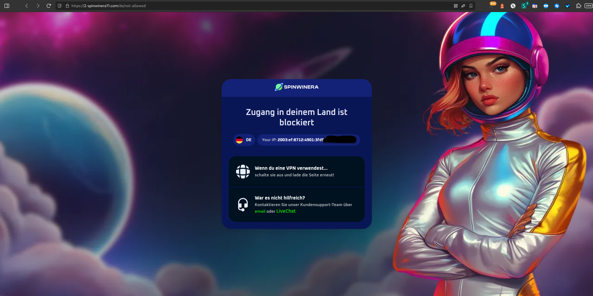

# Chain 9 – Mobile Simulated Domain Redirections for lagerfeuer.net

**Tracked:** Thursday, 05 March 2026 · 20:00–21:00 CET · Mobile simulated browser
**Threat category:** Gambling affiliate (unsolicited)

## Introduction

Chain 9 documents a gambling affiliate chain, entering via plenalo8.com - a casino affiliate rotator - and terminating at 2-spinwinera11.com, an online casino landing page. The chain performs internal cleanup redirects to strip tracking parameters before presenting the final page, a technique used to obscure affiliate identifiers from direct inspection. Affiliate parameters in the URL identify a Google PPC campaign (`afp10=Google_ppc`) routed through affiliate ID `qilu8s84482d`, confirming this is paid acquisition traffic. The presence of an online casino destination alongside political disinformation and VPN social engineering in the push notification ad rotation illustrates the breadth of harmful content categories active within the same ecosystem.

## Redirect Flow

```
plenalo8.com (casino affiliate rotator)
→ 2-spinwinera11.com (affiliate parameter cleanup)
→ 2-spinwinera11.com /casino (permanent redirect to root)
→ 2-spinwinera11.com (final destination - SpinWin Era online casino)
```

## Redirect Hops

| # | Status | IP | URL | Redirect Type | Notes |
|---|---|---|---|---|---|
| 1 | 302 | 2606:4700:3037::6815:400c | `https://plenalo8.com/casino?cxd=42989_239060…` | temporary | Casino Affiliate Rotator |
| 2 | 302 | 2606:4700::6812:1b71 | `https://2-spinwinera11.com/casino?cxd=42989_239060…` | temporary | Affiliate Parameter Cleanup |
| 3 | 301 | 2606:4700::6812:1b71 | `https://2-spinwinera11.com/casino?cxd=42989_239060…` | permanent | Permanent Redirect – /casino to Root |
| 4 | 200 | 2606:4700::6812:1b71 | `https://2-spinwinera11.com/?cxd=42989_2390607_%7Ca…` | none | Final Destination – Online Casino (SpinWin Era) |

## Screenshots



## AI Security Analysis

*Automated threat assessment · claude-sonnet-4-6*

Chain 9 directs mobile users to an online gambling platform (SpinWin Era / 2-spinwinera11.com) via a casino affiliate rotator (plenalo8.com). Gambling platforms accessed via unsolicited redirect chains represent a distinct harm category: they reach users at home, on personal devices, at any hour - conditions that research consistently associates with elevated impulsive gambling behaviour.

The affiliate model documented here creates a direct financial incentive for the chain operators to maximise the number of users reaching the gambling registration page, without any regard for whether those users sought gambling content or may be in a vulnerable state. The Google PPC attribution parameters (`afp10=Google_ppc`) embedded in the rotator URL mean that legitimate Google advertising infrastructure is credited in the commission chain, obscuring the true traffic source from the gambling operator.

Under Germany's Glücksspielstaatsvertrag (GlüStV 2021) and EU consumer protection law, unsolicited advertising of gambling services to an unverified audience - without prior consent or age verification at the ad delivery level - is prohibited. This chain constitutes a reportable violation to both BZgA (Federal Centre for Health Education) and the relevant state gambling authority.

---
*Generated with Claude · lagerfeuer.net Domain Abuse Report · claude-sonnet-4-6*

## Raw Redirect Data

| Status Code | URL | IP | Page Type | Redirect Type | Redirect URL |
|---|---|---|---|---|---|
| 302 | `https://plenalo8.com/casino?cxd=42989_2390607_%7Cafp1%3Aqilu8s84482d%7Cafp10%3AGoogle_ppc%7Cafp2%3Atrstden&afp1=qilu8s84482d&afp10=Google_ppc&afp2=trstden&bta=42989&nci=6091&qlt=true&successMirror=774669859634298029&stt=41216210406&rlc=1&rs_id=7a3c0b19-b54f-498d-85ed-b46ed73839a0&__tRid=c70473fb2160ba439f2afcb4d0bdf3f15c2e985e864806983bc76428cf5b7938&cookieEnabled=1&_fetchWrk=1#register` | 2606:4700:3037::6815:400c | server_redirect | temporary | `https://2-spinwinera11.com/casino?cxd=42989_2390607_%7Cafp1%3Aqilu8s84482d%7Cafp10%3AGoogle_ppc%7Cafp2%3Atrstden&afp1=qilu8s84482d&afp10=Google_ppc&afp2=trstden&bta=42989&nci=6091&qlt=true&rs_id=7a3c0b19-b54f-498d-85ed-b46ed73839a0&_rd=eyJyb3RhdG9ySWQiOiJjNzA0NzNmYjIxNjBiYTQzOWYyYWZjYjRkMGJkZjNmMTVjMmU5ODVlODY0ODA2OTgzYmM3NjQyOGNmNWI3OTM4Iiwicm90YXRvclJvdXRlciI6InBsZW5hbG84LmNvbSJ9#register` |
| 302 | `https://2-spinwinera11.com/casino?cxd=42989_2390607_%7Cafp1%3Aqilu8s84482d%7Cafp10%3AGoogle_ppc%7Cafp2%3Atrstden&afp1=qilu8s84482d&afp10=Google_ppc&afp2=trstden&bta=42989&nci=6091&qlt=true&rs_id=7a3c0b19-b54f-498d-85ed-b46ed73839a0&_rd=eyJyb3RhdG9ySWQiOiJjNzA0NzNmYjIxNjBiYTQzOWYyYWZjYjRkMGJkZjNmMTVjMmU5ODVlODY0ODA2OTgzYmM3NjQyOGNmNWI3OTM4Iiwicm90YXRvclJvdXRlciI6InBsZW5hbG84LmNvbSJ9#register` | 2606:4700::6812:1b71 | server_redirect | temporary | `https://2-spinwinera11.com/casino?cxd=42989_2390607_%7Cafp1%3Aqilu8s84482d%7Cafp10%3AGoogle_ppc%7Cafp2%3Atrstden&afp1=qilu8s84482d&afp10=Google_ppc&afp2=trstden&bta=42989&nci=6091&qlt=true#register` |
| 301 | `https://2-spinwinera11.com/casino?cxd=42989_2390607_%7Cafp1%3Aqilu8s84482d%7Cafp10%3AGoogle_ppc%7Cafp2%3Atrstden&afp1=qilu8s84482d&afp10=Google_ppc&afp2=trstden&bta=42989&nci=6091&qlt=true#register` | 2606:4700::6812:1b71 | server_redirect | permanent | `https://2-spinwinera11.com/?cxd=42989_2390607_%7Cafp1%3Aqilu8s84482d%7Cafp10%3AGoogle_ppc%7Cafp2%3Atrstden&afp1=qilu8s84482d&afp10=Google_ppc&afp2=trstden&bta=42989&nci=6091&qlt=true#register` |
| 200 | `https://2-spinwinera11.com/?cxd=42989_2390607_%7Cafp1%3Aqilu8s84482d%7Cafp10%3AGoogle_ppc%7Cafp2%3Atrstden&afp1=qilu8s84482d&afp10=Google_ppc&afp2=trstden&bta=42989&nci=6091&qlt=true#register` | 2606:4700::6812:1b71 | normal | none | none |
